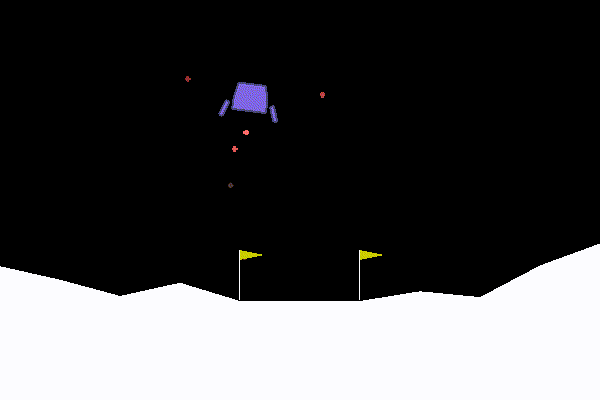

# GYM

A collection of machine learning programs using TFLean which is an abstracted version of Tensorflow.

## Environments

cartpole_vX - Goal is to balance a pole upright

lunarLander_vX - Goal is to land a small shuttle on the ground

MountainCarContinuous_vX - Goal is to move the cart to the top of a hill

## Built With

* [Tensorflow](https://www.tensorflow.org/) - Machine Learning Program used
* [TFlearn](http://tflearn.org/) - Abstracted version of Tensorflow
* [Python](https://www.python.org/) - Programming language used
* [GYM](https://gym.openai.com/) - graphical program environment

## Trained Model for lunar lander using lunarLander_v1.py

## Authors

* **Jared Tence** - *Programmed it* - [Github](https://github.com/jmanosu)

## Acknowledgments

* It was fun learning how machine learning works and how data influences the end result of nerual networks
